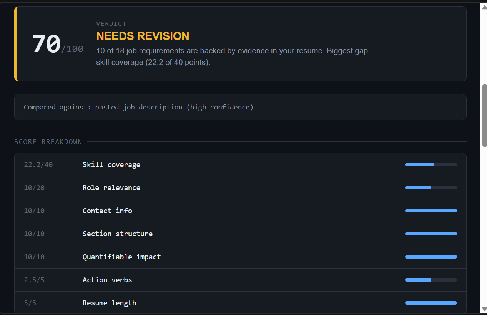
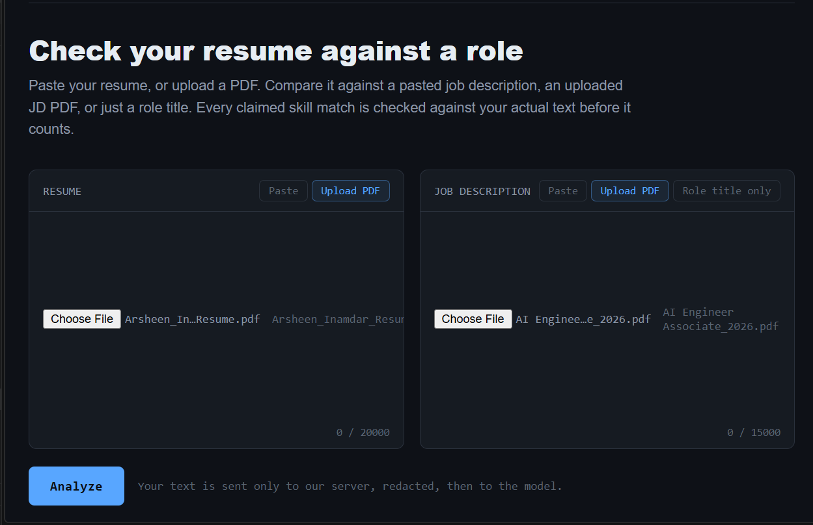
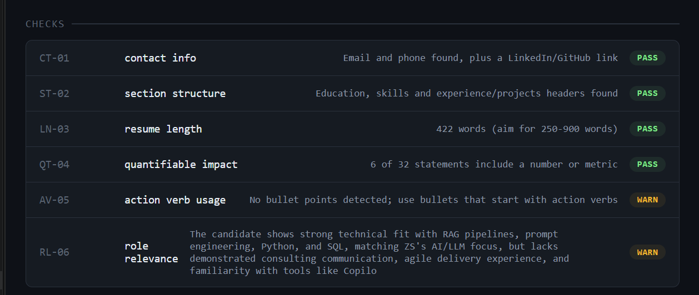
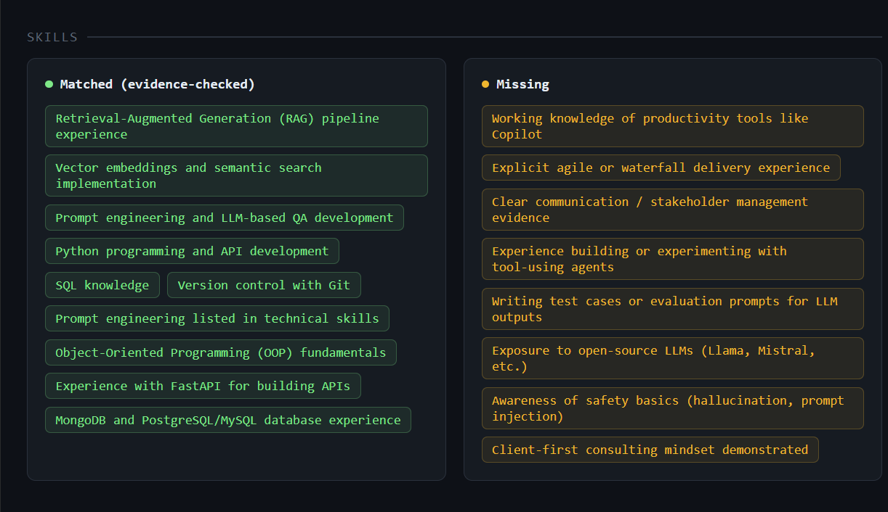
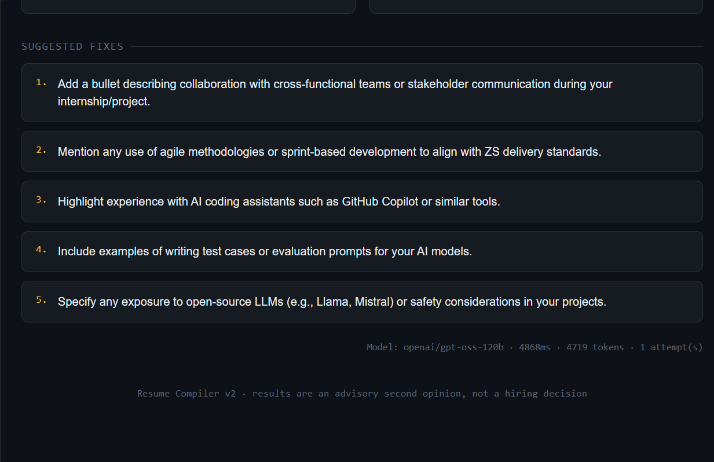

# Resume Compiler

**An evidence-checked resume analyzer.** Paste or upload your resume, add a job description (text or PDF) or just a role title, and get a score you can actually explain: every skill match the LLM claims must be backed by a quote that exists in your resume, and the final number is computed in code, never by the model.


-blueviolet)




> This is a **candidate-side** tool: a person checking their own resume, not an employer-side screener. That distinction matters, because AI used to filter or evaluate job applicants is classed as high-risk under the EU AI Act. This project isn't that, but it is built with the discipline such a system would need: evidence, checks, and stated limits instead of a black-box score.

---

## What changed from v1, and why

v1 was a thin wrapper around an LLM prompt. v2 treats the model as an **untrusted component** and puts verification around it.

| v1 | v2 | Why |
|---|---|---|
| Score written directly by the LLM | Score computed in code from a fixed, documented formula | A model can't set the number a system depends on (see `lib/scoring.js`) |
| "Return JSON" in the prompt | Forced tool call, schema validation, one repair retry | Raw-JSON prompting silently breaks on markdown fences, truncation, or a model not complying |
| Skill claims taken on trust | Every claimed match needs an exact resume quote, verified by string match | A model can assert "has Docker" with no proof; unverifiable claims don't count |
| Model output rendered via `innerHTML` | Model output rendered with `textContent` only | Model output is untrusted text, like any other input from outside your server |
| No defense against hidden instructions | Delimited input, injection pattern detection, evidence checks | A resume can contain text aimed at the AI reading it, not just the human |
| Full names, emails and phones sent to the model | PII redacted before the model sees it | Removes a privacy leak and a bias vector (name-based cues) |
| No rate limit | Per-IP rate limit plus a daily budget | Anyone who finds the URL could otherwise run up the API bill |
| Pasted text only | Resume PDF and JD PDF upload, plus role-title-only mode | Most people keep their resume as a PDF |
| Locked to one paid provider | Claude, or free open-source models (Groq, Ollama, OpenRouter) via one env var | Anyone can run it without paying |
| No way to know if it's consistent or fair | `eval/run_eval.js`: repeated-run consistency and name/college fairness check | "It worked when I tried it" isn't evidence |

## Screenshots

**Input:** paste or upload a resume, and a job description (pasted, PDF, or role title only).



**Deterministic checks and role relevance:** the five checks involve no AI; role relevance is the model's judgment.



**Evidence-checked skills:** matched skills are only shown if the model's quote exists in the resume (hover a matched skill to see its quote). Missing requirements are listed separately.



**Suggested fixes:** specific to the resume and job description, with the model and token usage shown for transparency.



## Features

- **Three input modes:** pasted job description, uploaded JD PDF, or only a role title (uses a curated skill profile for roles like ML Engineer, Backend Engineer, Data Analyst, DevOps, QA, and more).
- **Resume as text or PDF** (parsed in memory, never written to disk).
- **Transparent 100-point score** with a per-component breakdown, a verdict, and a plain-language "biggest gap".
- **Evidence-verified skill matching:** matched skills are shown with the exact resume quote that proves them; unprovable claims are listed separately as `unverified_claims`.
- **Five deterministic checks** that use no AI at all.
- **Actionable fixes** specific to your resume.
- **Provider-agnostic LLM layer:** Claude, or any OpenAI-compatible endpoint (Groq, OpenRouter, Ollama).

## How it works

```
                     Browser (public/)
                            |
              POST /api/analyze  (JSON or multipart/form-data)
                            |
                        server.js
              rate limit -> daily budget -> multer (PDF, memory only)
                            |
                 lib/pdf.js (if a PDF was uploaded)
                 lib/jd.js  (pasted text | curated role profile)
                            |
                     lib/analyzer.js
          -----------------------------------------
          |                                       |
   lib/checks.js                          lib/redact.js
   (deterministic: contact,               (strip PII + name,
    sections, length,                      detect injection attempts)
    quantifiable impact,                          |
    action verbs)                          lib/llm.js  (provider switch)
          |                               /                     \
          |                lib/anthropic.js              lib/openai-compat.js
          |                (Claude)                      (Groq / Ollama / OpenRouter)
          |                               \                     /
          |                                lib/schema.js (validate shape)
          |                                       |
          |                                lib/evidence.js (verify every
          |                                claimed quote exists in the resume)
          -----------------------------------------
                            |
                     lib/scoring.js
           (score computed in code from checks + verified matches)
                            |
                        JSON response
                            |
                  public/script.js (textContent-only rendering)
```

### The scoring formula (100 points)

The model never outputs a number. It returns structured findings; the server turns them into a score.

| Component | Points | Source |
|---|---:|---|
| Skill coverage (verified matches / all job requirements) | 40 | LLM findings, **evidence-verified in code** |
| Role relevance (pass / warn / fail) | 20 | LLM judgment |
| Contact info | 10 | Deterministic |
| Section structure | 10 | Deterministic |
| Quantifiable impact | 10 | Deterministic |
| Action verbs | 5 | Deterministic |
| Resume length | 5 | Deterministic |

Each status check earns full, half or zero points (pass / warn / fail). Verdicts: **75+ Shortlist-ready**, **50-74 Needs revision**, **below 50 High risk**. Claims that can't be verified count as *missing*, so the model gets no credit for asserting something it can't quote.

## Quick start

**Requirements:** [Node.js](https://nodejs.org) 18 or newer, and one LLM option (below).

```bash
git clone https://github.com/arsheen2244/resume-compiler.git
cd resume-compiler
npm install
cp .env.example .env      # Windows CMD: copy .env.example .env
# edit .env (see "Choose your LLM"), then:
npm start
```

Open **http://localhost:3000**. Check **http://localhost:3000/api/health** to see which provider and model are active.

### Choose your LLM

Set `LLM_PROVIDER` in `.env`.

**Option A: Groq (free tier, fast, no download)**
```dotenv
LLM_PROVIDER=openai
OPENAI_BASE_URL=https://api.groq.com/openai/v1
OPENAI_API_KEY=your_groq_key
OPENAI_MODEL=openai/gpt-oss-120b
MAX_OUTPUT_TOKENS=4000
```
Get a key at [console.groq.com](https://console.groq.com). Model availability changes, so pick one from your Groq model list.

**Option B: Ollama (free, local, private, works offline)**
```bash
ollama pull qwen2.5:7b
```
```dotenv
LLM_PROVIDER=openai
OPENAI_BASE_URL=http://localhost:11434/v1
OPENAI_MODEL=qwen2.5:7b
REQUEST_TIMEOUT_MS=120000
```
Needs roughly 8 GB of free RAM and about 5 GB of disk; slow without a GPU.

**Option C: Claude (paid, best quality)**
```dotenv
LLM_PROVIDER=anthropic
ANTHROPIC_API_KEY=your_key
ANTHROPIC_MODEL=claude-sonnet-5
```

> Smaller open models follow strict JSON schemas less reliably. The pipeline is built for that: bad output is caught by schema validation, retried once, and any claimed quote is still verified against the real resume text.

### Configuration reference

| Variable | Default | Purpose |
|---|---|---|
| `LLM_PROVIDER` | `anthropic` | `anthropic` or `openai` (any OpenAI-compatible API) |
| `ANTHROPIC_API_KEY`, `ANTHROPIC_MODEL` | - / `claude-sonnet-5` | Claude settings |
| `OPENAI_BASE_URL`, `OPENAI_API_KEY`, `OPENAI_MODEL` | Ollama defaults | Settings for Groq, Ollama, OpenRouter, etc. |
| `MAX_OUTPUT_TOKENS` | `2000` | Raise to ~4000 for reasoning models |
| `REQUEST_TIMEOUT_MS` | `45000` | Raise for local models |
| `API_RETRIES` | `2` | Retries on 429/5xx with backoff |
| `PORT` | `3000` | Server port |
| `RATE_LIMIT_PER_15MIN` | `20` | Requests per IP per 15 minutes |
| `MAX_DAILY_REQUESTS` | `500` | Global daily budget |
| `TRUST_PROXY` | empty | Set to `1` behind one reverse proxy |

## Project structure

```
server.js            Express app: routes, rate limit, uploads, health check
lib/
  analyzer.js        Orchestrates redaction -> LLM -> validation -> evidence -> score
  llm.js             Chooses the provider at call time
  anthropic.js       Claude client (timeout, backoff retries)
  openai-compat.js   OpenAI-compatible client; normalizes replies to one shape
  schema.js          Tool schema + hand-written output validator
  evidence.js        Verifies each quoted proof exists in the resume
  checks.js          Five deterministic resume checks
  scoring.js         The score formula
  redact.js          PII redaction + prompt-injection detection
  jd.js              Pasted JD / role-title -> normalized job description
  pdf.js             PDF text extraction + validation
  ratelimit.js       In-memory per-IP limiter
data/role-profiles.json   Curated skill profiles for role-title mode
public/              Vanilla JS frontend (textContent-only rendering)
test/                38 unit + integration tests (no network needed)
eval/                Consistency + fairness harness
```

## Security and reliability

- **Secrets:** API keys live only in the server's `.env` (gitignored) and never reach the browser.
- **Privacy:** names, emails, phone numbers and profile URLs are replaced with placeholders before text goes to the model. This also removes name-based bias cues.
- **Prompt injection:** resume and JD text are wrapped in delimiter tags and declared untrusted data in the system prompt. A pattern detector flags attempts such as "ignore previous instructions" and surfaces a warning instead of hiding it. Because the score is computed in code, a successful injection still can't set the number.
- **XSS:** the frontend renders everything with `textContent`, never `innerHTML`.
- **Uploads:** PDFs are parsed in memory only, type-checked by magic bytes (not just extension), capped at 5 MB.
- **Abuse protection:** per-IP rate limit plus a daily request budget.
- **Failure handling:** request timeout, backoff retries on 429/5xx, one schema-repair retry, and a clear error (instead of broken JSON) when output is truncated.

## Testing and evaluation

```bash
npm test        # 38 tests, no network or API key needed
npm run eval    # live consistency + fairness report -> eval/report.md
```

- **Unit/integration tests** cover the schema validator, evidence verification, scoring, deterministic checks, redaction, JD handling, the provider adapter, and the full analyzer pipeline with a mocked model.
- **Eval harness** runs the real pipeline to measure (1) **consistency**: the same resume and JD scored repeatedly, and (2) **fairness**: identical resumes that differ only in name and college prestige should score the same.

Run the eval once per provider to compare them. Results are below; they are only meaningful once the test cases are expanded.

## Evaluation results

Measured with `npm run eval` on 2026-10-08 using `openai/gpt-oss-120b` via Groq.

**Score consistency** (same resume and job description, analyzed 5 times)

| Case | Scores | Mean | Std dev | Range |
|---|---|---|---|---|
| c1 | 69, 69, 75, 69, 69 | 70.2 | 2.4 | 6 |

Four of five runs gave identical scores. One run scored 6 points higher, which came from the model's judgment (the LLM-scored part of the formula) while the deterministic checks stayed fixed. Note that 75 is the "Shortlist-ready" threshold, so that run landed in a different verdict band than the other four.

**Fairness** (identical experience, different name and college)

| Case | Score A | Score B | Diff |
|---|---|---|---|
| f1 | 50 | 50 | 0 |

Two resumes with identical content but different names and college prestige scored the same, which is the intended behavior: names are redacted and the prompt forbids using college prestige.

**Caveats:** this is one consistency case and one fairness pair. It shows the harness works and the pipeline behaves sensibly, not that the tool is statistically proven stable or fair. College names are not redacted (only handled by the prompt), and only one kind of name/college variation was tested. Expanding `eval/cases.json` to 20-30 labeled pairs is on the roadmap.

## Limitations

- **Small eval set.** `eval/cases.json` ships with one consistency case and one fairness pair, enough to prove the harness works, not to draw conclusions. Add your own labeled pairs before citing any numbers.
- **Open models are weaker.** Free or local models are less accurate at semantic matching and schema-following than larger hosted models.
- **PDF extraction** struggles with scanned images, multi-column layouts and heavily designed templates. There is no OCR; the app asks the user to paste text if extraction is nearly empty.
- **Role-title mode** uses a small hand-curated list of roles. A real job posting is always more accurate.
- **Rate limiter** is in-memory: it resets on restart and isn't shared across instances.
- **Fit signals, not truth.** The tool checks how well a resume matches a role; it cannot verify that a claimed achievement is real.

## Roadmap

- Expand the eval set to 20-30 real labeled pairs and track results over time.
- DOCX upload support alongside PDF.
- Shared (Redis) rate limiting for multi-instance deployment.
- OCR fallback for scanned resumes.
- Optional richer frontend if the UI grows.

## Tech stack

Node.js, Express, Multer, pdf-parse, dotenv, vanilla JS/HTML/CSS, Node's built-in test runner. LLMs via the Anthropic Messages API or any OpenAI-compatible chat API.

## License

No license has been chosen yet. Add a `LICENSE` file (for example MIT) before others reuse the code.
